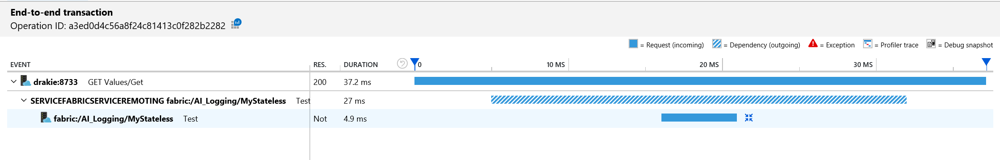
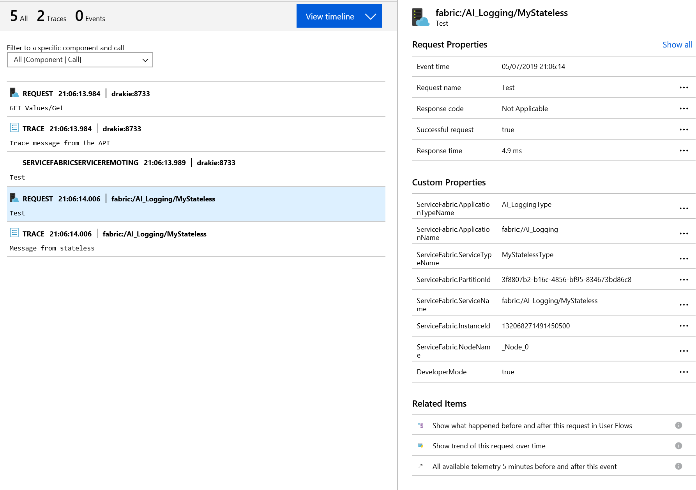
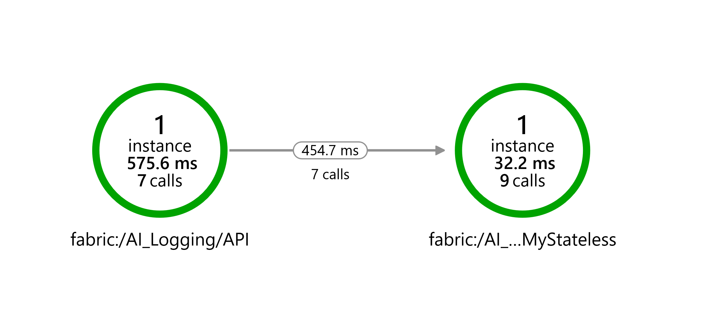

# ApplicationInsights-ServiceFabric-NativeLogging
Minimum code to configure a Service Fabric Service to log to Application Insights.

This project provides a mimum reference setup for use of Application Insights with Service Fabric.
The documentation provided on the Service Fabric project it self https://github.com/microsoft/ApplicationInsights-ServiceFabric
wasn't clear enough. Hopefully this will help someone or someone has suggestions for improvement to 
this setup.

## Step by Step
If you look at the individual commits you will see the major steps:

1. A simple Service Farbic application with an AspNet Core API application and a single stateless 
service behind it. The API calls the stateless services and returns it result.  
This has been setup with the latest version at the time of writing. Note that the nuget packages use 
version 3.4.639 instead of 641 this is because of an incompatibility with the Application Insight 
package.
2. Added Application Insights NuGets
3. Added Application Insights to the AspNet Core project. You can follow 
https://github.com/microsoft/ApplicationInsights-ServiceFabric for this. Because this project uses
remoting 2.1 the remoting telemetry modules are also added
4. Added Application Insights to the Stateless Service. This is the mimum to get things to work with
depdency tracking and the basic Service Fabric Telemetry properties.  
Note: the configuration code works but there is defintely room for improvement.
5. The previous steps use the configuration; this steps adds the values to the files. The value is set
using configurable parameters the actual instrumentation key only needs to be specified in the
deployment parameters (e.g. AI-Logging\ApplicationParameters\Local.1Node.xml).

## Results

The end to end transaction shows the complete request.
* *GET Values/Get* the incomming request on the web API
* *SERVICEFABRICSERVICEREMOTING fabric:/AI_Logging/MyStateless* the outgoing remoting dependency
* *fabric:/AI_Logging/MyStateless Test* the incomming remoting request on the stateless service

The telemetry shows all message including the two trace message using the TelemetryClient  
Note: that these the order may be out of order because of the sub millisecond timing.

The application map also shows the services with the appropriate dependency.

